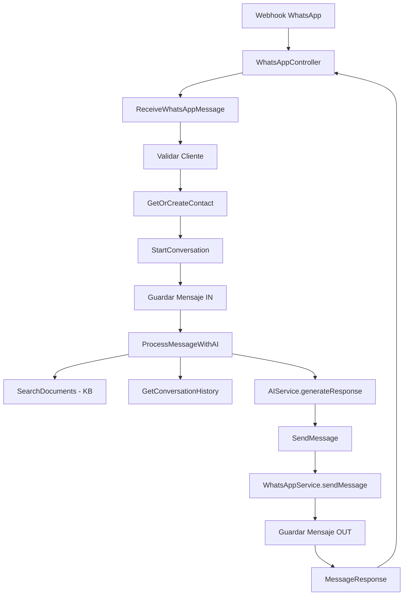

# Arquitectura de la Capa de Aplicación - Chatbot WhatsApp IA

## 📋 Resumen Completo

He implementado completamente la **capa de aplicación** siguiendo los principios de **Arquitectura Hexagonal (Ports & Adapters)** y **Domain-Driven Design (DDD)**.

## 🏗️ Estructura Creada

### 1. **DTOs (Data Transfer Objects)**

```
application/dto/
├── MessageCommand.java        # Input: mensaje entrante
├── MessageResponse.java       # Output: respuesta del sistema
└── ConversationInfo.java      # Output: info de conversación
```

### 2. **Puertos de Salida (Interfaces)**

```
application/ports/out/
├── EmbeddingsPort.java        # Generación de embeddings
├── VectorStore.java           # Almacén vectorial (existente)
├── WhatsAppService.java       # 🆕 Servicio de WhatsApp
└── AIService.java             # 🆕 Servicio de IA generativa
```

### 3. **Casos de Uso (Use Cases)**

```
application/usecases/
├── ReceiveWhatsAppMessage.java    # 🎯 ORQUESTADOR PRINCIPAL
├── ProcessMessageWithAI.java      # 🧠 Lógica de IA + RAG
├── SendMessage.java               # 📤 Envío de mensajes
├── StartConversation.java         # 💬 Iniciar conversación
├── CloseConversation.java         # ✅ Cerrar conversación
├── GetOrCreateContact.java        # 👤 Gestión de contactos
├── GetConversationHistory.java    # 📜 Historial
├── SearchDocuments.java           # 🔍 Búsqueda KB (existente)
├── IngestDocuments.java           # 📥 Indexar KB (existente)
└── MigrateVectors.java            # 🔄 Migración (existente)
```

## 🔄 Flujo Completo de Procesamiento



## 📊 Componentes Principales

### **ReceiveWhatsAppMessage** (Orquestador)

Coordina todo el flujo de procesamiento:

```java
public MessageResponse handle(MessageCommand command) {
    // 1. Validar cliente
    Client client = getClient(command.clientCode());
    
    // 2. Obtener/crear contacto
    Contact contact = getOrCreateContact.handle(...);
    
    // 3. Obtener/crear conversación
    Conversation conversation = startConversation.handle(...);
    
    // 4. Guardar mensaje entrante
    messageRepository.save(incomingMessage);
    
    // 5. Generar respuesta con IA
    String aiResponse = processMessageWithAI.handle(...);
    
    // 6. Enviar respuesta
    Message response = sendMessage.handle(...);
    
    return MessageResponse.success(...);
}
```

### **ProcessMessageWithAI** (RAG + IA)

Implementa **Retrieval-Augmented Generation**:

```java
public String handle(String userMessage, UuidId<Conversation> conversationId, String namespace) {
    // 1. Buscar contexto relevante en KB usando embeddings
    List<String> contextDocs = searchRelevantContext(userMessage, namespace);
    
    // 2. Obtener historial de conversación
    List<Map<String, String>> history = getConversationHistory(conversationId);
    
    // 3. Generar respuesta con IA usando contexto + historial
    return aiService.generateResponse(userMessage, contextDocs, history);
}
```

## 🔌 Interfaces Implementadas

### **WhatsAppService**
```java
public interface WhatsAppService {
    String sendMessage(String from, String to, String message);
    String sendTemplate(String from, String to, String templateId, Map<String, String> params);
}
```

**Implementación sugerida**: Twilio, Meta WhatsApp Business API

### **AIService**
```java
public interface AIService {
    String generateResponse(String userMessage, List<String> context, List<Map<String, String>> history);
    String generateSimpleResponse(String userMessage);
}
```

**Implementación sugerida**: OpenAI GPT-4, Claude, Llama

## 📝 Sistema de IDs Actualizado

```java
// Interfaz sellada base
public sealed interface Id<T> permits UuidId, LongId

// UUID para la mayoría de entidades
UuidId<Client>        // Clientes
UuidId<Conversation>  // Conversaciones
UuidId<Message>       // Mensajes
UuidId<Contact>       // Contactos

// Long para entidades con secuencias
LongId<OutboundItem>  // Cola de salida
LongId<UsageDaily>    // Métricas diarias
```

## 🎯 Beneficios de la Arquitectura

### 1. **Separación de Responsabilidades**
- **Dominio**: Lógica de negocio pura
- **Aplicación**: Orquestación de casos de uso
- **Infraestructura**: Detalles técnicos

### 2. **Testabilidad**
```java
// Fácil de testear con mocks
@Test
void shouldProcessWhatsAppMessage() {
    // Given
    MessageCommand command = new MessageCommand(...);
    when(clientRepository.findByCode("test")).thenReturn(Optional.of(client));
    
    // When
    MessageResponse response = useCase.handle(command);
    
    // Then
    assertTrue(response.success());
}
```

### 3. **Flexibilidad**
- Cambiar de Twilio a Meta WhatsApp: solo implementar `WhatsAppService`
- Cambiar de OpenAI a Claude: solo implementar `AIService`
- Cambiar de pgvector a Pinecone: solo implementar `VectorStore`

### 4. **Mantenibilidad**
- Cada caso de uso tiene una responsabilidad única
- Fácil de entender y modificar
- Bajo acoplamiento

## 🚀 Próximos Pasos

### Implementaciones Pendientes

1. **Servicios de Infraestructura**
```
infrastructure/adapters/out/
├── whatsapp/
│   └── TwilioWhatsAppServiceImpl.java
├── ai/
│   ├── OpenAIServiceImpl.java
│   └── OpenAIEmbeddingsImpl.java
└── vector/
    └── PgVectorStoreImpl.java
```

2. **Repository Faltante**
```java
// domain/ports/messaging/
public interface ContactRepository {
    Optional<Contact> findByClientAndPhone(UuidId<Client> clientId, String phone);
    void save(Contact contact);
}
```

3. **Configuración**
```yaml
# application.yml
app:
  whatsapp:
    provider: twilio
    account-sid: ${TWILIO_ACCOUNT_SID}
    auth-token: ${TWILIO_AUTH_TOKEN}
  
  ai:
    provider: openai
    api-key: ${OPENAI_API_KEY}
    model: gpt-4o-mini
    
  knowledge-base:
    default-namespace: kb
    top-k-results: 5
```

4. **Mejoras**
- Circuit Breaker para llamadas externas
- Rate limiting por cliente
- Métricas y monitoreo
- Logs estructurados
- Tests unitarios e integración

## 📚 Patrones Aplicados

1. **Use Case Pattern**: Cada operación es un caso de uso
2. **Dependency Inversion**: Dependemos de interfaces, no implementaciones
3. **Single Responsibility**: Una clase, una responsabilidad
4. **Command Pattern**: DTOs como comandos
5. **Repository Pattern**: Acceso a datos abstrac to
6. **Ports & Adapters**: Desacoplamiento de infraestructura
7. **RAG (Retrieval-Augmented Generation)**: IA con contexto

## ✅ Estado Actual

- ✅ Capa de dominio completa
- ✅ Sistema de IDs (UUID + Long) implementado
- ✅ Ports y adapters de persistencia actualizados
- ✅ **Capa de aplicación completamente implementada**
- ⏳ Implementaciones de infraestructura (siguiente paso)
- ⏳ Tests unitarios
- ⏳ Configuración externalizada

## 🎓 Conclusión

La capa de aplicación está **completa y lista para usar**. Implementa un flujo robusto de chatbot con IA que:

- Recibe mensajes de WhatsApp
- Procesa con IA usando RAG (contexto del KB)
- Mantiene historial de conversaciones
- Envía respuestas inteligentes
- Es extensible y mantenible

**Siguiente paso**: Implementar los adapters de infraestructura (Twilio, OpenAI, pgvector).

